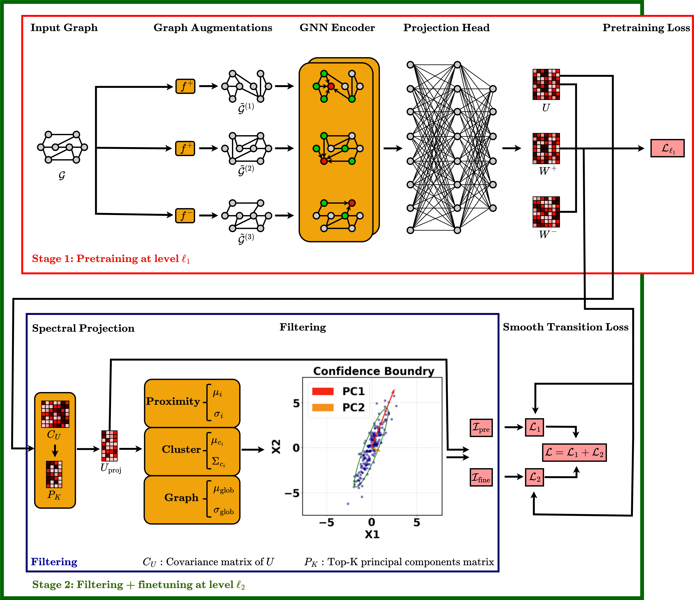

## Geometry‑Aware Dual‑Stage Self-Supervised Learning: A Unified Objective and a Filtering Mechanism for Smooth Cross‑Level Transitions
Graph self‑supervised learning (GSSL) has evolved into a fundamental strategy, offering an effective way to exploit the rich structural and semantic information in graphs without relying on costly annotations. Current approaches can be classified into four levels of granularity: node, proximity, cluster, and graph. However, these GSSL methods vary in objective functions and augmentations across abstraction levels, downstream tasks, and datasets. This obscures how the levels interact. We introduce a unified contrastive objective, dubbed UniGSSL, that is instantiated identically at the four levels with a fixed data augmentation pipeline across tasks, datasets, and levels. The unified contrastive loss and augmentation protocol enables a controlled study of dual‑stage training where pretraining and finetuning occur at different levels. From a geometric viewpoint, we show that naïve level switching yields abrupt distortions in latent manifolds, measured by a sudden change in the gap between linear and intrinsic dimension (LID–ID) of the latent manifolds. To mitigate this problem, we propose a filtering mechanism that gradually transfers training by partitioning nodes between the source‑ and target‑level losses according to confidence in a low‑dimensional spectral space. Across six benchmarks, the unified single‑stage model (SS-UniGSSL) matches or surpasses state‑of‑the‑art level‑specific baselines, although it has a fixed objective and augmentation hyperparameters. The dual‑stage model (DS-UniGSSL) further improves downstream task performance. Finally, the proposed dual‑stage model equipped with our filtering mechanism (DSF-UniGSSL) consistently obtains the best average results while smoothing LID–ID transitions, confirming the superiority of the pretraining-filtering-finetuning paradigm compared with the elementary pretraining-finetuning paradigm.

# Environment Setup 
To set up the project environment, run the following command:

```bash
conda env create -f environment.yml
```
The dual-stage model with the filtering mechanism (DSF-UniGSSL) can be tested on the Cora dataset using the following commands, which specify the optimal filtering threshold and the dimensionality of the spectral space.
# Node Classification

```
python eval_filter_level.py --dataset=cora --pretraining_type=node --finetuning_type=prox --filtering_threshold=14.0 --pca_n_comp=35 --seed=15 --device_number=0
```

# Node Clustering 

```
python eval_filter_level_node_clustering.py --dataset=cora --pretraining_type=cluster --finetuning_type=graph --filtering_threshold=2.0 --pca_n_comp=45 --seed=15 --device_number=0
```
# Link prediction
```
python eval_linkp_filter_level.py --dataset=cora --pretraining_type=node --finetuning_type=cluster --filtering_threshold=18.0 --pca_n_comp=15 --seed=15 --device_number=0